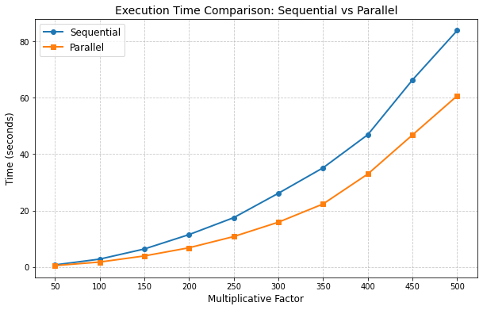

# Bicubic Spline Interpolation

**Bicubic spline interpolation** is an arithmetic method commonly used for resizing images and performing smooth interpolation of pixel values. This guide explains how to perform bicubic interpolation in Python using the `Pillow` library.

---

## Table of Contents
1. [Introduction](#introduction)
2. [Prerequisites](#prerequisites)
3. [Installation](#installation)
4. [Usage Example](#usage-example)

---

## Introduction

Bicubic interpolation is a technique that considers the values of nearby pixels to calculate new pixel values. Compared to other interpolation methods, such as bilinear, bicubic interpolation offers smoother results, making it ideal for scaling images. The parallel implementation is running on 3 CPU cores and is calculating the interpolation for each color channel on parallel.

---

## Prerequisites

Before diving in, ensure you have the following:
- Python 3.6 or newer.
- The Pillow library for image manipulation.

---

## Installation

Install Pillow using pip:
```bash
pip install pillow
```
---


## Usage Example

Below is a step-by-step example demonstrating how to use bicubic interpolation with Pillow to resize an image.

```bash
python3 bsisequential.py <Input Image> <Multiplicative Factor> <Output Image>
```
or

```bash
python3 bsiparallel.py <Input Image> <Multiplicative Factor> <Output Image>
```
## Metrics




